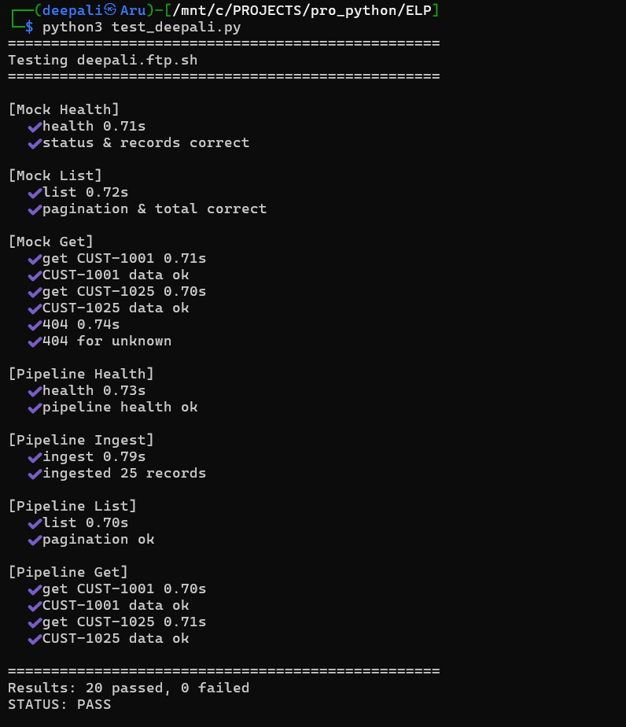

# Customer Data Pipeline

<h1>Live: https://deepali.ftp.sh</h1>

End-to-end data ingestion pipeline that pulls customer records from a mock REST API, processes and upserts them into PostgreSQL, and exposes them through a query API.

## Architecture

```
                         Nginx (:80)
                     deepali.ftp.sh
                    ┌───────────────┐
          /mock/* → │  reverse      │ ← /*
                    │  proxy        │
                    └──┬─────────┬──┘
                       │         │
             ┌─────────▼──┐  ┌──▼───────────────┐     ┌────────────┐
             │ Flask      │  │ FastAPI           │─SQL─▶│ customers  │
             │ Mock Server│  │ Pipeline Service  │◀─SQL─│ table      │
             │ :5000      │  │ :8000             │     └────────────┘
             └────────────┘  └───────────────────┘        PostgreSQL
```

**Flow:** Flask serves raw customer JSON → FastAPI fetches all pages, coerces types, and upserts into Postgres via `ON CONFLICT DO UPDATE` → query endpoints serve paginated results from the DB.

## Quick Start

```bash
docker-compose up -d --build
```

Wait a few seconds for Postgres to become healthy, then:

```bash
# health checks
curl http://localhost:5000/api/health
curl http://localhost:8000/api/health

# browse mock data
curl "http://localhost:5000/api/customers?page=1&limit=5"

# trigger ingestion
curl -X POST http://localhost:8000/api/ingest

# query ingested data
curl "http://localhost:8000/api/customers?page=1&limit=5"
curl http://localhost:8000/api/customers/CUST-1001
```

## Project Layout

```
├── docker-compose.yml
├── nginx/
│   └── deepali.ftp.sh.conf    # Nginx reverse-proxy config
├── mock-server/
│   ├── app.py                  # Flask API
│   ├── data/customers.json     # seed data (25 records)
│   ├── Dockerfile
│   └── requirements.txt
└── pipeline-service/
    ├── main.py                 # FastAPI app + endpoints
    ├── database.py             # SQLAlchemy engine / session
    ├── models/customer.py      # ORM model
    ├── services/ingestion.py   # fetch + upsert logic
    ├── Dockerfile
    └── requirements.txt
```

## API Reference

### Mock Server (`:5000`)

| Endpoint | Method | Description |
|---|---|---|
| `/api/health` | GET | Liveness check |
| `/api/customers?page=&limit=` | GET | Paginated customer list |
| `/api/customers/{id}` | GET | Single customer by ID |

### Pipeline Service (`:8000`)

| Endpoint | Method | Description |
|---|---|---|
| `/api/health` | GET | Liveness check |
| `/api/ingest` | POST | Fetch from mock server → upsert into DB |
| `/api/customers?page=&limit=` | GET | Paginated query from Postgres |
| `/api/customers/{id}` | GET | Single customer by ID (from DB) |

## Design Decisions

- **Gunicorn** in front of Flask for the mock server — mirrors production practice even for a small service.
- **`ON CONFLICT DO UPDATE`** (Postgres upsert) keeps the ingest endpoint idempotent; safe to call multiple times.
- **`httpx`** over `requests` in the pipeline service — async-capable, lighter, actively maintained.
- **Health checks + `depends_on` conditions** in Compose ensure Postgres is ready before either app service starts.
- Tables are auto-created on FastAPI startup via `Base.metadata.create_all` — keeps the demo self-contained without needing Alembic.

## VPS Deployment (Ubuntu + Nginx Reverse Proxy)

The app is hosted behind Nginx on an Ubuntu VPS at **`https://deepali.ftp.sh`**.

| URL | Backend |
|---|---|
| `https://deepali.ftp.sh/api/*` | Pipeline Service (FastAPI :8000) |
| `https://deepali.ftp.sh/mock/api/*` | Mock Server (Flask :5000) — `/mock` prefix is stripped |

### Setup Steps

```bash
# 1. Clone & start containers
cd /path/to/deepali_test
docker-compose up -d --build

# 2. Copy nginx config into sites-available
sudo cp nginx/deepali.ftp.sh.conf /etc/nginx/sites-available/deepali.ftp.sh

# 3. Enable the site
sudo ln -sf /etc/nginx/sites-available/deepali.ftp.sh /etc/nginx/sites-enabled/

# 4. Test & reload nginx
sudo nginx -t
sudo systemctl reload nginx
```

### Live URLs

```bash
# health checks
curl https://deepali.ftp.sh/api/health
curl https://deepali.ftp.sh/mock/api/health

# trigger ingestion
curl -X POST https://deepali.ftp.sh/api/ingest

# query pipeline data
curl "https://deepali.ftp.sh/api/customers?page=1&limit=5"
curl https://deepali.ftp.sh/api/customers/CUST-1001

# browse mock data
curl "https://deepali.ftp.sh/mock/api/customers?page=1&limit=5"
```

> **Note:** Docker ports are bound to `127.0.0.1` so services are only accessible through Nginx, not directly from the internet.

## Tear Down

```bash
docker-compose down -v   # -v removes the pgdata volume
```
